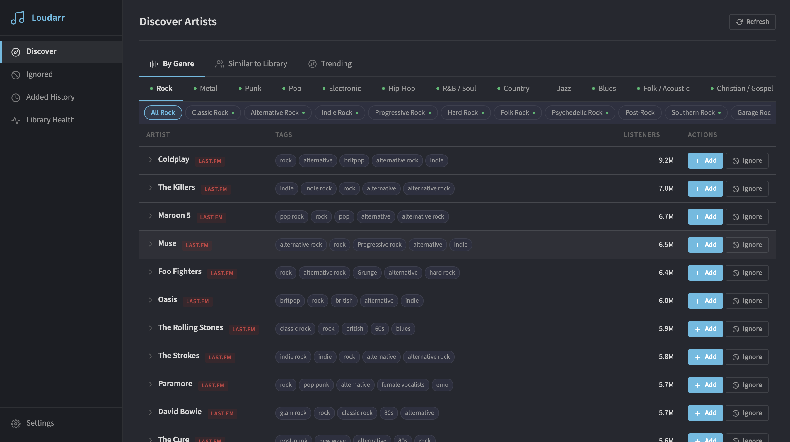
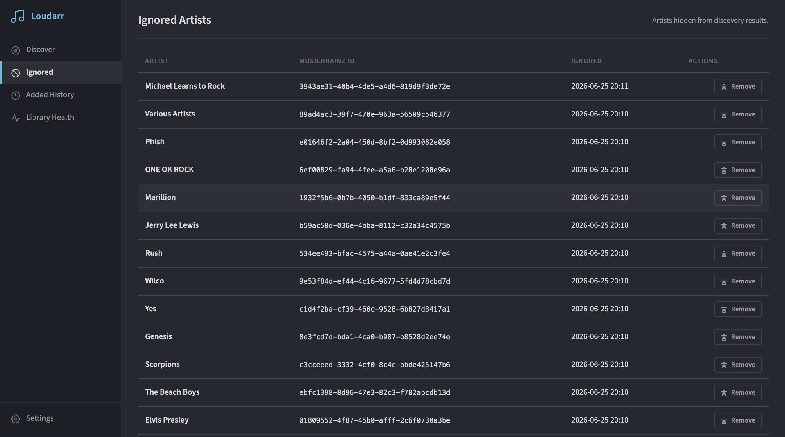
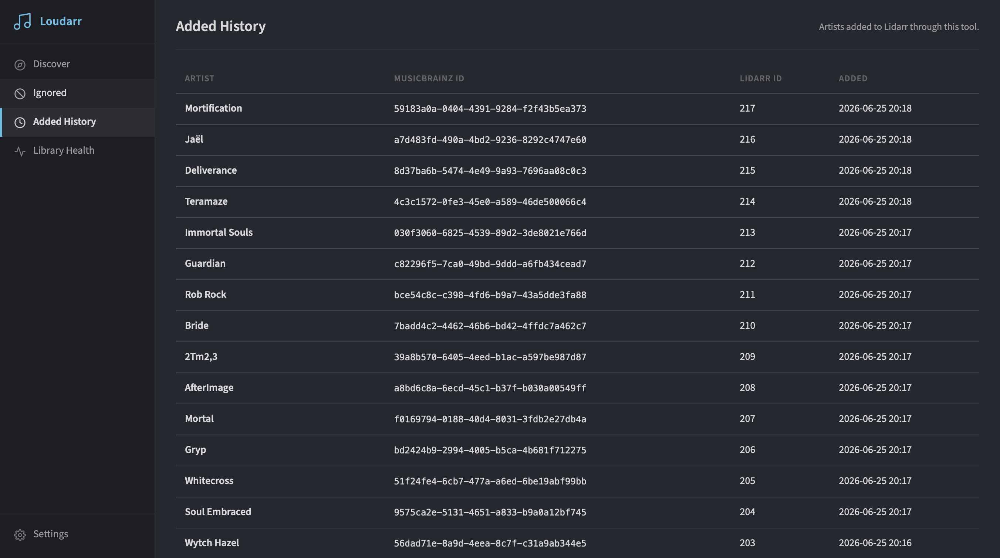
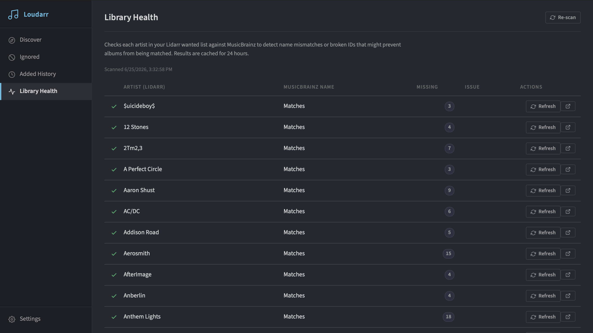

# Loudarr

A self-hosted music discovery tool that connects to your [Lidarr](https://lidarr.audio) library and suggests new artists to add — browsable by genre, similar to your existing library, or globally trending. Built as a Docker web app with a dark UI that matches Lidarr's aesthetic.

---

## Features

- **Genre discovery** — browse 17 broad categories (Rock, Metal, Pop, Jazz, Electronic, Christian, and more) with sub-genre chips for granular filtering
- **Similar to Library** — finds artists similar to ones already in Lidarr *(requires Last.fm API key)*
- **Trending** — pulls globally trending artists from ListenBrainz
- **Multi-source** — aggregates results from Last.fm, MusicBrainz, Deezer, and ListenBrainz; all sources except Last.fm require no API key
- **Add to Lidarr directly** — choose quality profile, metadata profile, root folder, and monitor type from within the app
- **Ignore artists** — hide suggestions you never want to see again; ignored artists are excluded from all future results
- **Library Health scan** — checks every artist in your Lidarr wanted list against MusicBrainz and flags name mismatches or broken IDs that could prevent albums from being matched
- **Added History** — tracks every artist you have added through Loudarr
- **24-hour result cache** — fast repeat loads; one-click refresh clears the cache

---

## Screenshots

### Discover Artists
Browse by genre with broad category tabs and sub-genre chips. Artists are sorted by listener count and show their source (Last.fm, MusicBrainz, Deezer, or ListenBrainz).



### Ignored Artists
Artists you have dismissed from discovery. They are permanently excluded from all suggestion results and can be removed from the list at any time.



### Added History
A log of every artist added to Lidarr through Loudarr, including their MusicBrainz ID and Lidarr ID.



### Library Health
Scans your Lidarr wanted list against MusicBrainz to detect name mismatches or broken IDs. Green rows are verified, orange rows have minor name differences, red rows indicate a significant mismatch or missing MBID. Each artist has a one-click Refresh button to queue a metadata re-fetch in Lidarr.



---

## Requirements

- Docker and Docker Compose
- A running [Lidarr](https://lidarr.audio) instance with API access
- *(Optional)* A free [Last.fm API key](https://www.last.fm/api/account/create) — enables the **Similar to Library** mode and improves listener counts and artist bios. MusicBrainz, Deezer, and ListenBrainz work without any key.

---

## Installation

```yaml
# docker-compose.yml
services:
  loudarr:
    image: loudarr
    build: .
    container_name: loudarr
    ports:
      - "5055:5000"
    volumes:
      - loudarr-data:/data
    restart: unless-stopped

volumes:
  loudarr-data:
```

```bash
git clone https://github.com/youruser/loudarr.git
cd loudarr
docker compose up -d --build
```

Open **http://localhost:5055** — you will be redirected to Settings on first run.

---

## Configuration

All settings are stored in the app's SQLite database (persisted in the `loudarr-data` Docker volume) and are configurable from the **Settings** page.

| Setting | Required | Description |
|---|---|---|
| Lidarr URL | Yes | Base URL of your Lidarr instance, e.g. `http://192.168.1.10:8686` |
| Lidarr API Key | Yes | Found in Lidarr → Settings → General |
| Last.fm API Key | No | Enables Similar to Library mode and richer artist data |
| Min. Listeners | No | Filters out artists below this Last.fm monthly listener count (default 10,000) |
| Extra Genres | No | Comma-separated genre tags to add to the genre picker |

### Discovery Sources

| Source | API Key | Genre Discovery | Similar Artists | Trending | Notes |
|---|---|---|---|---|---|
| Last.fm | Required | Yes | Yes | No | Best listener counts and artist bios |
| MusicBrainz | None | Yes | No | No | Rate-limited to 1 req/sec; adds MBIDs |
| Deezer | None | Yes (broad) | No | No | Good artist images |
| ListenBrainz | None | No | No | Yes | Powers the Trending tab |

When Last.fm is configured it acts as the primary source; MusicBrainz and Deezer supplement with artists and images not already returned by Last.fm.

---

## Library Health

The **Library Health** page compares every artist in your Lidarr wanted list to their linked MusicBrainz ID and flags:

- **Name mismatch** — the artist's canonical name on MusicBrainz differs from what Lidarr has stored (common when an artist has changed their name, e.g. Kanye West → Ye)
- **Wrong or missing MBID** — the stored ID does not resolve to any MusicBrainz artist, which will prevent Lidarr from matching releases

Clicking **Refresh** queues a `RefreshArtist` command in Lidarr, which re-pulls metadata from MusicBrainz. For cases where the MBID is entirely wrong, use the MusicBrainz link (↗) to find the correct artist and re-add them in Lidarr.

Results are cached for 24 hours. Use **Re-scan** to force a fresh check.

---

## Data & Privacy

All data (config, ignored artists, added history, discovery cache) is stored locally in a SQLite database inside the `loudarr-data` Docker volume. Loudarr makes outbound requests to Lidarr, Last.fm, MusicBrainz, Deezer, and ListenBrainz APIs on your behalf. No data is sent anywhere else.

---

## License

Copyright 2026 Chris Wiedmaier

Licensed under the [Apache License, Version 2.0](LICENSE). You may use, copy, modify, and distribute this software under the terms of that license. See the [LICENSE](LICENSE) file for the full text.
